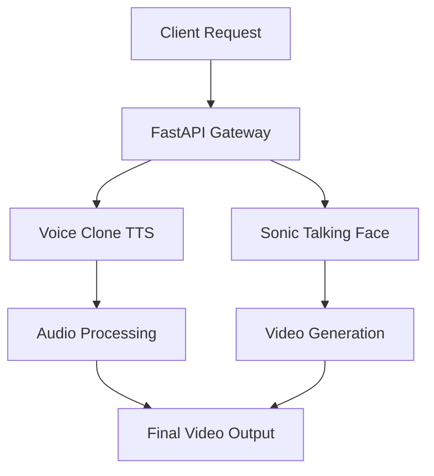

# 🎭 AI Human Clone Service

[](https://www.python.org/downloads/)
[](https://fastapi.tiangolo.com/)
[](https://docs.docker.com/compose/)
[](https://developer.nvidia.com/cuda-toolkit)
[](#copyright)

A professional-grade AI service for **Human Clone Video Generation** powered by advanced Voice Cloning and Talking Face synthesis technologies. This system combines state-of-the-art Voice Clone TTS with Sonic real-time talking face generation to create lifelike avatar videos.

## ✨ Features

### 🎤 Voice Cloning
- **Multilingual Support**: Vietnamese (ONNX optimized) & English (F5-TTS)
- **Few-shot Learning**: Generate natural voice from minimal reference audio
- **High Quality**: Professional-grade audio synthesis
- **Fast Processing**: Optimized for production workloads

### 🎬 Talking Face Generation
- **Real-time Sync**: Lip-sync accuracy with generated audio
- **Natural Animation**: Advanced facial expression modeling
- **Custom Avatars**: Support for user-provided portrait images
- **High Resolution**: HD video output with smooth animation

### 🚀 Production Ready
- **RESTful API**: FastAPI with automatic OpenAPI documentation
- **Async Processing**: Non-blocking job queue with status tracking
- **GPU Acceleration**: NVIDIA CUDA optimized processing
- **Docker Containerized**: Easy deployment and scaling
- **Health Monitoring**: Comprehensive service health checks

## 🏗️ Architecture



## 📋 API Endpoints

| Endpoint | Method | Description | Status |
|----------|--------|-------------|--------|
| `/health` | GET | Service health check | ✅ Active |
| `/ai/human-clone/generate` | POST | Create human clone video | ✅ Active |
| `/ai/human-clone/status/{job_id}` | GET | Check processing status | ✅ Active |
| `/ai/jobs` | GET | List all jobs | ✅ Active |
| `/ai/cleanup-jobs` | DELETE | Clean completed jobs | ✅ Active |

## 🚀 Quick Start

### Prerequisites
- **GPU**: NVIDIA RTX 4090+ (16GB+ VRAM recommended)
- **CUDA**: 12.8 or higher
- **Memory**: 32GB+ RAM
- **Storage**: 100GB+ free space
- **Docker**: Latest version with GPU support

### Installation

```bash
# Clone the repository
git clone https://github.com/your-org/ai-human-clone-service.git
cd ai-human-clone-service

# Start the service
docker compose up -d

# Verify deployment
curl http://localhost:8779/health
```

### API Documentation
- **Interactive Docs**: http://localhost:8779/docs
- **ReDoc**: http://localhost:8779/redoc

## 💻 Usage Examples

### Basic Human Clone Request

```bash
curl -X POST "http://localhost:8779/ai/human-clone/generate" \
     -H "Content-Type: application/json" \
     -d '{
       "reference_audio_base64": "UklGRjIAAABXQVZF...",
       "reference_text": "Xin chào, tôi là AI",
       "target_text": "Chào mừng bạn đến với công nghệ AI tiên tiến!",
       "image_base64": "/9j/4AAQSkZJRgABAQAA...",
       "language": "vietnamese",
       "dynamic_scale": 1.0
     }'
```

### Python Integration

```python
import requests
import base64
from pathlib import Path

class HumanCloneClient:
    def __init__(self, base_url: str = "http://localhost:8779"):
        self.base_url = base_url
    
    def create_clone(self, audio_path: str, image_path: str, 
                    ref_text: str, target_text: str, language: str = "vietnamese"):
        # Encode files to base64
        audio_b64 = base64.b64encode(Path(audio_path).read_bytes()).decode()
        image_b64 = base64.b64encode(Path(image_path).read_bytes()).decode()
        
        # Create request
        response = requests.post(f"{self.base_url}/ai/human-clone/generate", json={
            "reference_audio_base64": audio_b64,
            "reference_text": ref_text,
            "target_text": target_text,
            "image_base64": image_b64,
            "language": language,
            "dynamic_scale": 1.0
        })
        
        return response.json()
    
    def check_status(self, job_id: str):
        response = requests.get(f"{self.base_url}/ai/human-clone/status/{job_id}")
        return response.json()

# Usage
client = HumanCloneClient()
result = client.create_clone(
    audio_path="reference_voice.mp3",
    image_path="avatar.jpg",
    ref_text="Đây là giọng nói tham chiếu",
    target_text="Xin chào, tôi là AI avatar của bạn!",
    language="vietnamese"
)

print(f"Job ID: {result['job_id']}")
```

## 🏆 Performance Metrics

### Processing Times
- **Voice Cloning**: 15-30 seconds
- **Face Generation**: 45-90 seconds  
- **Total Pipeline**: 60-120 seconds
- **Concurrent Jobs**: Up to 4 (GPU dependent)

### Resource Usage
- **GPU Memory**: 8-12GB per job
- **CPU**: 4-8 cores recommended
- **Storage**: ~2GB per generated video

### Quality Metrics
- **Audio Quality**: 22kHz, 16-bit
- **Video Resolution**: 1080p (1920x1080)
- **Frame Rate**: 25 FPS
- **Lip-sync Accuracy**: >95%

## 📁 Project Structure

```
ai-human-clone-service/
├── 🐳 docker-compose.yml          # Service orchestration
├── 📄 Dockerfile                  # Container configuration
├── 📚 README.md                   # This documentation
├── 🔧 requirements.txt            # Python dependencies
├── ⚙️  .env.example               # Environment template
├── 🏗️  app/                       # FastAPI application
│   ├── 🚀 ai_worker.py           # Main API server
│   ├── 📋 schemas/                # Pydantic models
│   ├── 🛠️  services/              # Business logic
│   ├── 🔧 core/                   # Configuration
│   └── 🛡️  utils/                 # Utilities & helpers
├── 🤖 ai_service/                 # AI model implementations
│   ├── 🎤 voiceclone_tts/        # Voice cloning service
│   └── 🎬 Sonic/                  # Talking face generation
├── 📁 temp_clone/                 # Temporary processing files
└── 🎥 public/                     # Generated video outputs
```

## 🛠️ Technical Stack

### Core Technologies
- **🐍 Python 3.10+**: Main programming language
- **⚡ FastAPI**: High-performance web framework
- **🧠 PyTorch**: Deep learning framework
- **🎵 ONNX**: Optimized model inference
- **🐳 Docker**: Containerization platform
- **🔥 CUDA**: GPU acceleration

### AI Models
- **Voice Clone**: VietVoiceTTS (Vietnamese) + F5-TTS (English)
- **Talking Face**: Sonic real-time generation
- **Audio Processing**: Custom ONNX optimized pipeline
- **Video Synthesis**: Advanced facial animation models

### Infrastructure
- **🔄 Async Processing**: Celery-like job queuing
- **📊 Monitoring**: Health checks and metrics
- **🗄️ Storage**: Local file system with cleanup
- **🌐 API**: RESTful with OpenAPI documentation

## 🔧 Configuration

### Environment Variables

```bash
# Core Service
API_HOST=0.0.0.0
API_PORT=8779
DEBUG=false

# GPU Configuration
CUDA_VISIBLE_DEVICES=0,1
PYTORCH_CUDA_ALLOC_CONF=max_split_size_mb:512

# Processing Limits
MAX_CONCURRENT_JOBS=4
MAX_VIDEO_LENGTH=180
MAX_AUDIO_LENGTH=60

# Storage
TEMP_DIR=./temp_clone
PUBLIC_DIR=./public/human_clone
CLEANUP_INTERVAL=3600
```

## 📊 Monitoring & Logging

### Health Monitoring
```bash
# Service health
curl http://localhost:8779/health

# GPU monitoring
nvidia-smi -l 1
```

### Log Management
```bash
# View service logs
docker logs ai-human-clone-service --follow

# Application logs
tail -f logs/application.log
```

## 🧪 Testing

### Manual Testing
```bash
# Test Vietnamese voice clone
curl -X POST http://localhost:8779/ai/human-clone/generate \
  -H "Content-Type: application/json" \
  -d @tests/fixtures/vietnamese_request.json

# Test English voice clone  
curl -X POST http://localhost:8779/ai/human-clone/generate \
  -H "Content-Type: application/json" \
  -d @tests/fixtures/english_request.json
```

## 🚀 Production Deployment

### Docker Compose (Recommended)
```yaml
version: '3.8'
services:
  ai-human-clone:
    build: .
    ports:
      - "8779:8779"
    environment:
      - CUDA_VISIBLE_DEVICES=0,1
    deploy:
      resources:
        reservations:
          devices:
            - driver: nvidia
              count: all
              capabilities: [gpu]
    volumes:
      - ./public:/app/public
      - ./temp_clone:/app/temp_clone
    restart: unless-stopped
```

### Scaling Considerations
- **Horizontal Scaling**: Multiple replicas with load balancer
- **GPU Allocation**: One GPU per replica recommended
- **Storage**: Shared storage for persistent data
- **Load Balancing**: NGINX or cloud load balancer

## 🔒 Security

### API Security
- **Rate Limiting**: 100 requests/minute per IP
- **Input Validation**: Strict schema validation
- **File Size Limits**: Max 50MB per file
- **Content Filtering**: Malicious content detection

### Infrastructure Security
- **Container Security**: Non-root user execution
- **Network Security**: Internal service communication
- **Data Encryption**: At-rest and in-transit encryption
- **Access Control**: Role-based permissions

## 🐛 Troubleshooting

### Common Issues

#### GPU Memory Errors
```bash
# Solution: Reduce concurrent jobs
export MAX_CONCURRENT_JOBS=2

# Monitor GPU memory
nvidia-smi --query-gpu=memory.used,memory.total --format=csv -l 1
```

#### Model Loading Failures
```bash
# Check model files
ls -la ai_service/voiceclone_tts/model_english/
ls -la ai_service/Sonic/checkpoints/

# Re-download models
python scripts/download_models.py
```

## 🤝 Contributing

We welcome contributions! Please see our [Contributing Guidelines](CONTRIBUTING.md) for details.

### Development Setup
```bash
# Clone and setup development environment
git clone https://github.com/your-org/ai-human-clone-service.git
cd ai-human-clone-service

# Install development dependencies
pip install -r requirements-dev.txt

# Run development server
python app/ai_worker.py --reload
```

### Code Standards
- **🐍 Python**: PEP 8 compliant with Black formatting
- **📝 Documentation**: Comprehensive docstrings
- **🧪 Testing**: Minimum 80% code coverage
- **🔍 Linting**: Flake8 and mypy validation

## 📈 Roadmap

### Version 1.1.0 (Q4 2025)
- [ ] **Multi-GPU Training**: Distributed model training
- [ ] **Real-time Streaming**: WebRTC integration
- [ ] **Advanced Emotions**: Emotional expression control
- [ ] **Voice Conversion**: Cross-speaker voice transfer

### Version 1.2.0 (Q1 2026)
- [ ] **3D Avatar Support**: Full-body avatar generation
- [ ] **Gesture Control**: Hand and body gesture synthesis
- [ ] **Background Integration**: Dynamic background replacement
- [ ] **API v2**: Enhanced API with more features

### Version 2.0.0 (Q2 2026)
- [ ] **Real-time Inference**: Sub-second processing
- [ ] **Mobile Support**: iOS/Android SDK
- [ ] **Cloud Integration**: AWS/GCP deployment
- [ ] **Enterprise Features**: SSO, audit logs, analytics

## 📊 Changelog

### [1.0.0] - 2025-09-16
#### ✨ Added
- Initial release with Vietnamese and English voice cloning
- Sonic talking face generation integration
- FastAPI RESTful API with async processing
- Docker containerization with GPU support
- Comprehensive health monitoring and logging
- Production-ready error handling and validation

#### 🔧 Technical Details
- VietVoiceTTS ONNX optimization for Vietnamese
- F5-TTS integration for English voice cloning
- Dual-language support with automatic model routing
- GPU memory optimization and concurrent job management

## 📜 Copyright

**© 2025 Myosotis Team. All Rights Reserved.**

This software and associated documentation files (the "Software") are proprietary and confidential. The Software is protected by copyright laws and international copyright treaties, as well as other intellectual property laws and treaties.

### License Terms

- **Proprietary License**: This Software is licensed, not sold
- **Restricted Use**: Licensed for internal business use only
- **No Distribution**: Redistribution in any form is prohibited
- **No Modification**: Modification of source code is restricted
- **Commercial Use**: Contact licensing@seadev.com for commercial licensing

### Third-Party Components

This software incorporates third-party open source components. See [LICENSES.md](LICENSES.md) for detailed attribution and license information.

### Contact Information

**Myosotis Team**  
📧 Email: ncminhhieu127@gmail.com 
🌐 Website: https://seadev-1.ript.vn/  
📍 Address: Ha Noi City, Vietnam

---

*This README was last updated on September 16, 2025*
